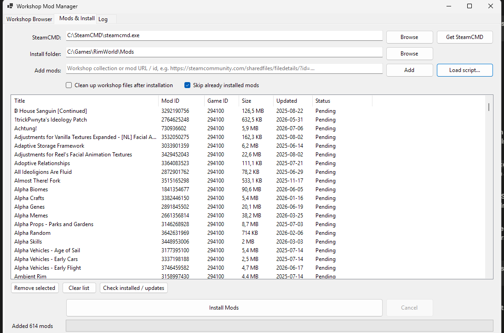

# Workshop Manager


A Windows application designed to simplify the installation and management of Steam Workshop mods. It resolves Workshop collections locally via the official Steam Web API, downloads mods with SteamCMD and installs them into your game — no external website or script files required.



## Features

- 🌐 Built-in Steam Workshop browser (WebView2) — browse collections and mods, import them with one click
- 📦 Local collection processing via the official Steam Web API (nested collections supported, no scraping)
- 👤 Import your subscribed items from your Steam profile (all pages, using your own browser session)
- ⬇️ One-click SteamCMD download and setup
- 🔁 Batched downloads with automatic retries — reliable even for large collections
- 🔍 Mod list with titles, sizes, update dates, and installed/update-available status
- ⏭️ Skips already installed mods (optional) and detects available updates
- 📊 Real-time progress tracking and cancellable operations
- 🧹 Optional cleanup of raw workshop files after installation (all games in the run)
- 📝 Comprehensive logging system
- 📄 Legacy SteamCMD script files (e.g. from softknight.de) can still be imported

## Prerequisites

- Windows 64-bit operating system
- [.NET 8.0 Runtime](https://dotnet.microsoft.com/download/dotnet/8.0)
- [Microsoft WebView2 Runtime](https://developer.microsoft.com/microsoft-edge/webview2/) (preinstalled on Windows 10/11; only needed for the built-in browser)
- Sufficient disk space for mod downloads

SteamCMD is **not** required upfront — the app can download and set it up for you via the "Get SteamCMD" button.

## Getting Started

1. Download the latest release from the [releases page](https://github.com/Vijabei/SteamWorkshopManager/releases)
2. Extract the files to your desired location and run `WorkshopManager.exe`
3. On the **Mods & Install** tab, set the SteamCMD path (or click **Get SteamCMD**) and choose your mod install folder
4. Add mods in one of three ways:
   - Browse the Workshop on the **Workshop Browser** tab and click **Add this collection / mod to list**
   - Paste a collection/mod URL or id into the **Add mods** field
   - Import a legacy SteamCMD script file via **Load script...**
5. Click **Install Mods**

## Notes on Steam usage

- Collections are resolved through the official, public Steam Web API — no login, no API key, and no HTML scraping involved.
- Downloads use SteamCMD with anonymous login. Some games do not allow anonymous workshop downloads; affected items are reported as failed in the mod list.
- Downloads run in small batches with automatic retries to stay well within Steam's limits.
- Your Steam credentials are never requested or stored by this application.

## Building from Source

1. Clone the repository:
```bash
git clone https://github.com/Vijabei/SteamWorkshopManager.git
```

2. Open the solution in Visual Studio 2022 or later

3. Build the solution:
```bash
dotnet build
```

## Contributing

Contributions are welcome! Please feel free to submit a Pull Request.

1. Fork the project
2. Create your feature branch (`git checkout -b feature/AmazingFeature`)
3. Commit your changes (`git commit -m 'Add some AmazingFeature'`)
4. Push to the branch (`git push origin feature/AmazingFeature`)
5. Open a Pull Request

## License

This project is licensed under the [Creative Commons Attribution-NonCommercial 4.0 International License](https://creativecommons.org/licenses/by-nc/4.0/).

This means you are free to:
- Share — copy and redistribute the material in any medium or format
- Adapt — remix, transform, and build upon the material

Under the following terms:
- Attribution — You must give appropriate credit, provide a link to the license, and indicate if changes were made
- NonCommercial — You may not use the material for commercial purposes

The licensor cannot revoke these freedoms as long as you follow the license terms.

## Acknowledgments

- [SteamCMD](https://developer.valvesoftware.com/wiki/SteamCMD) by Valve Corporation
- Script generator and tools hosted at [softknight.de](https://softknight.de)

## Support

If you encounter any issues, please create an issue in the [GitHub issue tracker](https://github.com/Vijabei/SteamWorkshopManager/issues).
