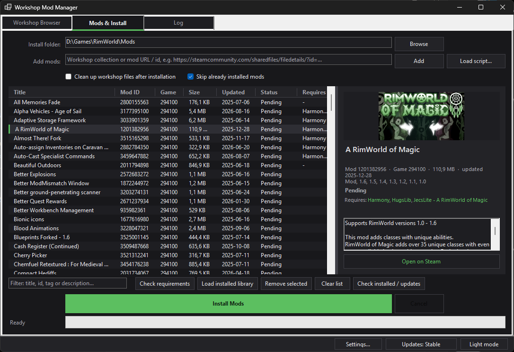

# Workshop Manager


A Windows application designed to simplify the installation and management of Steam Workshop mods. It resolves Workshop collections locally via the official Steam Web API, downloads mods with SteamCMD and installs them into your game — no external website or script files required.



## Features

- 🔄 Automatic updates — the app checks GitHub for new versions and updates itself with one click, on a stable or beta channel
- 🌐 Built-in Steam Workshop browser (WebView2) — browse collections and mods, import them with one click
- 📦 Local collection processing via the official Steam Web API (nested collections supported, no scraping)
- 👤 Import your subscribed items from your Steam profile (all pages, using your own browser session)
- ⬇️ One-click SteamCMD download and setup
- 🔁 Batched downloads with automatic retries — reliable even for large collections
- 🔍 Mod list with titles, sizes, update dates, and installed/update-available status
- 🖼️ Detail pane per mod — preview image, tags and the full Workshop description, rendered from Steam's BBCode instead of showing raw markup
- 🔗 Required mods and required DLC are detected and listed, and every requirement links straight into the built-in browser
- 📚 Mod library — title, description, tags and preview of every mod you ever installed are kept locally, so the details survive a mod being removed from the Workshop
- 📤 Export the library as Markdown files (one per mod, with YAML front matter) for your own notes or a server wiki
- 🎨 Dark and light theme, switchable at any time
- ⚙️ Settings dialog for SteamCMD, install folder, batch size, retries and update channel
- ⏭️ Skips already installed mods (optional) and detects available updates
- 📊 Real-time progress tracking and cancellable operations
- 🧹 Optional cleanup of raw workshop files after installation (all games in the run)
- 📝 Comprehensive logging system
- 📄 Legacy SteamCMD script files (e.g. from softknight.de) can still be imported

## Prerequisites

- Windows 64-bit operating system
- [.NET 8.0 Runtime](https://dotnet.microsoft.com/download/dotnet/8.0)
- [Microsoft WebView2 Runtime](https://developer.microsoft.com/microsoft-edge/webview2/) (preinstalled on Windows 10/11; only needed for the built-in browser)
- Sufficient disk space for mod downloads

SteamCMD is **not** required upfront — the app can download and set it up for you via the "Get SteamCMD" button.

## Getting Started

1. Download the latest release from the [releases page](https://github.com/Vijabei/SteamWorkshopManager/releases)
2. Extract the files to your desired location and run `WorkshopManager.exe`
3. Open **Settings...** (bottom bar), click **Download it for me** to fetch SteamCMD — or point to an existing `steamcmd.exe` — and choose your mod install folder
4. Add mods in one of three ways:
   - Browse the Workshop on the **Workshop Browser** tab and click **Add this collection / mod to list**
   - Paste a collection/mod URL or id into the **Add mods** field
   - Import a legacy SteamCMD script file via **Load script...**
5. Click **Install Mods**

## Notes on Steam usage

- Collections are resolved through the official, public Steam Web API — no login, no API key, and no HTML scraping involved.
- Downloads use SteamCMD with anonymous login. Some games do not allow anonymous workshop downloads; affected items are reported as failed in the mod list.
- Downloads run in small batches with automatic retries to stay well within Steam's limits.
- Your Steam credentials are never requested or stored by this application.

## Building from Source

1. Clone the repository:
```bash
git clone https://github.com/Vijabei/SteamWorkshopManager.git
```

2. Open the solution in Visual Studio 2022 or later

3. Build the solution:
```bash
dotnet build
```

## Releases

Releases are built by GitHub Actions, not on a developer machine.

1. Set `<Version>` in `WorkshopManager.csproj` (e.g. `1.3.0`, or `1.3.0-beta.1`
   for a pre-release) and commit it.
2. Tag the commit with the same version prefixed by `v` and push the tag:
   `git tag v1.3.0 && git push origin v1.3.0`.
3. The workflow builds on a clean runner, checks that tag, project file and
   the version stamped into the executable all agree, and prepares the
   release as a **draft**. A version suffix such as `-beta.1` marks it as a
   pre-release automatically.
4. Review the notes on GitHub and publish. Publishing is what makes installed
   copies offer the update, so it is deliberately a separate step.

If the tag and the project version disagree, the run fails before building.

## Contributing

Contributions are welcome! Please feel free to submit a Pull Request.

1. Fork the project
2. Create your feature branch (`git checkout -b feature/AmazingFeature`)
3. Commit your changes (`git commit -m 'Add some AmazingFeature'`)
4. Push to the branch (`git push origin feature/AmazingFeature`)
5. Open a Pull Request

## License

Licensed under the [Apache License, Version 2.0](LICENSE).

You are free to use, modify and redistribute this software, including
commercially. In return the license asks that you keep the copyright and
license notices, state which files you changed, and accept that the software
comes with no warranty. It also grants you the relevant patent rights.

Versions up to and including 1.1.0 were published under CC BY-NC 4.0. Anyone
who received a copy under that license keeps those rights; everything from
here on is Apache 2.0.

## Acknowledgments

- [SteamCMD](https://developer.valvesoftware.com/wiki/SteamCMD) by Valve Corporation
- Script generator and tools hosted at [softknight.de](https://softknight.de)

## Support

If you encounter any issues, please create an issue in the [GitHub issue tracker](https://github.com/Vijabei/SteamWorkshopManager/issues).
